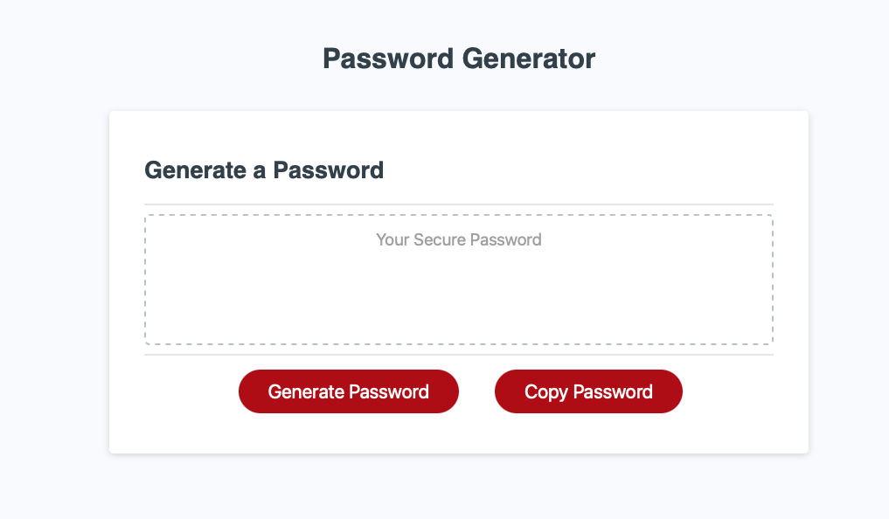

# password-generator

This is a password generator that includes a button to generate a password and a button to copy the password to the clipboard. The user gets to choose how long the password is and the type of characters that are used.

Here is [link](https://seanscraig.github.io/password-generator) to the live webpage

## Installation

Use git clone to clone the repository on your local machine and then open in a web browser.

## Contributing
Pull requests are welcome. For major changes, please open an issue first to discuss what you would like to change.
